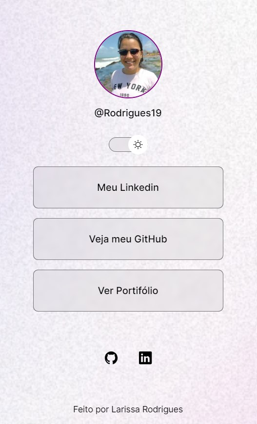

# Meu portifólio

* Criei este portifólio durante meus estudos do [Discover](https://www.rocketseat.com.br/discover) da [Rocketseat](https://www.rocketseat.com.br/). Onde pude rever alguns conceitos estudados anteriormente e me ajudou a criar esse projeto no qual usarei como meu primeiro portifólio. 

## Tecnologias 

Este projeto foi desenvolvido com as seguintes tecnologias:

* HTML e CSS
* JavaScript
* Git e Github

### Você pode ver como ficou aqui :grin: 
  [Meu portifólio web](https://rodrigues19.github.io/portifolio-simples/)
